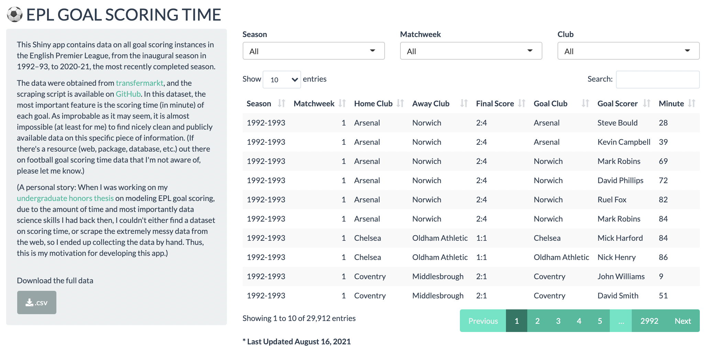
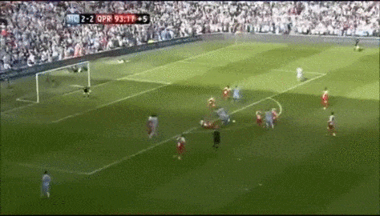

One of the items on my to-do list for this summer is to learn and make a Shiny app. I finally did it! Check out the app [here](https://qntkhvn.shinyapps.io/epl_goal_time).



## Description

This is a very simple Shiny app which provides data on all goal scoring events in the English Premier League, from its first season, 1992-93, to the last completed season, 2020-21. 

The data were obtained from [transfermarkt](https://www.transfermarkt.us/premier-league/spieltag/wettbewerb/GB1). In this dataset, the most important feature is the scoring time (in minute) of each goal. As improbable as it may seem, it is impossible (at least for me) to find nicely clean and publicly available data on this specific piece of information. Back in 2020, when I was working on my undergraduate honors thesis on modeling EPL goal scoring, due to the amount of time and most importantly data science skills I had back then, I couldn't either find a dataset on scoring time, or scrape the extremely messy data from the web, so I ended up collecting the data by hand. Thus, this is my motivation for developing this app.

I certainly would like to add more information to this data, such as the dates and kick-off times of the matches. There are also several issues with this app that need to be addressed in the future. In particular, the data do not specify whether a goal was an own-goal or not. As a result, the variable goal scorer represents players that scored both for and against their team. Fixing this is something I'm definitely interested in working on.

As usual, the source code for this project can be found on [GitHub](https://github.com/qntkhvn/epl_goal_time).

## Exploring

Let's quickly explore the EPL goal scoring data provided by my new Shiny app.

```{r}
library(tidyverse)
library(kableExtra)
theme_set(theme_bw())
```

```{r}
goals <- read_csv("goals.csv")
```

### Famous Goals

If you are a long time follower of the EPL, these famous goals should be familiar to you.

**Beckham from the halfway line**

```{r}
goals %>% 
  filter(goal_scorer == "David Beckham" & season == "1996-1997" & matchweek == 1) %>% 
  kable()
```


**Rooney's bicycle-kick**

```{r}
goals %>% 
  filter(goal_scorer == "Wayne Rooney" & season == "2010-2011" & matchweek == 27) %>% 
  kable()
```


**The Hat-trick by number 20 to clinch title number 20 for Man United**

```{r}
goals %>% 
  filter(goal_scorer == "Robin Van Persie" & season == "2012-2013" & matchweek == 34) %>% 
  kable()
```


**And yes...93:20**

```{r}
goals %>% 
  filter(goal_scorer == "Sergio Aguero" & minute == "90+4") %>% 
  kable()
```



### EDA

**Who were the Top 5 All-Time EPL Goal Scorers?**

```{r}
goals %>% 
  count(goal_scorer, sort = TRUE) %>% 
  slice_head(n = 5) %>% 
  kable()
```

**Which players have scored more than 30 goals in a season?**

```{r}
goals %>% 
  count(goal_scorer, season, sort = TRUE) %>% 
  filter(n >= 30) %>% 
  kable()
```

(Note: There were 22 clubs and 42 matchweeks in the first 3 EPL seasons (92-93, 93-94, 94-95), before the number of clubs was reduced to 20 (hence 38 matchweeks) at the start of 95-96.)

**What are the highest-scoring teams in the EPL history?**

```{r}
goals %>% 
  count(goal_club, season, sort = TRUE) %>% 
  filter(n >= 90) %>% 
  kable()
```

**What is the goal scoring trend since 2010?**

```{r, fig.height = 6}
goals %>% 
  filter(as.numeric(str_sub(season, end = -6)) > 2009) %>% 
  mutate(season = str_replace(season, "-", "-\n")) %>% # re-format season
  count(season) %>% 
  ggplot(aes(x = season, y = n, group = 1)) +
  geom_point(aes(size = n), show.legend = FALSE) +
  geom_line() +
  labs(title = "2014-2015 was a low-scoring season")
```

