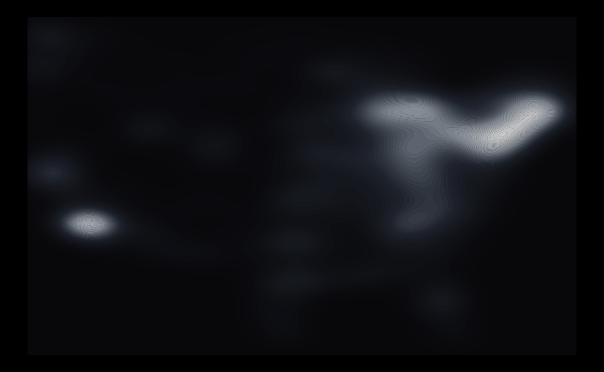

If I show you the following graphic, what do you think this is?

{width=90%}

Take a moment and think about it before reading any further.

...

...

...

Anyway, I'll begin to reveal the answer now.

So, as I was hunting (pun-intended) for a dataset for my data viz [class](https://36-315-summer26.netlify.app/) to illustrate how to make maps,
I stumbled upon a [TidyTuesday](https://github.com/rfordatascience/tidytuesday) gem: [Haunted places in the United States](https://github.com/rfordatascience/tidytuesday/blob/main/data/2023/2023-10-10/readme.md) (week 41, 2023).

```{r}
library(tidyverse)
haunted_places <- read_csv("https://raw.githubusercontent.com/rfordatascience/tidytuesday/master/data/2023/2023-10-10/haunted_places.csv") |> 
  filter(state %notin% c("Alaska", "Hawaii"))
haunted_places
```

Nothing complicated here.
The data contain locations of haunted spots across the country.
(And sorry, Alaska and Hawaii, I’m omitting you for convenience.)

In fancy spatial data terms, this is a case of [point pattern data](https://en.wikipedia.org/wiki/Point_pattern_analysis).
All we have here are 2D coordinates (longitude and latitude) over space.
The focus is: Where are the points?

Visualizing 2D spatial point pattern data is as simple as making a scatterplot... because it's literally just a scatterplot... wearing a fancy geographic trench coat.
Strip away the geography, and we're just plotting dots on a grid (hence the term dot maps or bubble maps).
The only difference is that the base layer is a map instead of a blank canvas.

A common goal of point pattern analysis to understand how the density of events varies across space.
Thus, we can use basically any 2D density estimation viz for this (e.g., contours, heatmaps, etc.)

Back to the haunted places data, the map I originally wanted to make (for pedagogical purpose) is the following:

*(Note: I'm going old-school by making maps with `geom_polygon()` and changing projections with the superseded `coord_map()`. I'm fully aware the gold standard these days is `geom_sf()` and `coord_sf()`, and I'm going to teach those in my class. But for this post, I'm not gonna go there.)*

```{r}
ggplot() +
  geom_polygon(data = map_data("state"),
               aes(long, lat, group = group),
               fill = "gray75", color = "gray20", alpha = 0.1) +
  geom_point(data = haunted_places, 
             aes(city_longitude, city_latitude),
             color = "white", alpha = 0.1, size = 0.3) +
  coord_map("albers", lat0 = 39, lat1 = 45, xlim = c(-118, -75)) +
  theme_void() +
  theme(plot.background = element_rect(fill = "black"),
        plot.margin = margin(0, 0, 0, 0))
```

My first version of this figure did not include state borders, so it looks like this:

```{r}
haunted_places |> 
  ggplot(aes(city_longitude, city_latitude)) +
  geom_point(color = "white", alpha = 0.1, size = 0.3) +
  coord_map("albers", lat0 = 39, lat1 = 45, xlim = c(-118, -75)) +
  theme_void() +
  theme(plot.background = element_rect(fill = "black"),
        plot.margin = margin(0, 0, 0, 0))
```

I thought this looks cool and wanted to make it more data-artsy.
Since this is about haunted places, my goal was to make it more "ghostly".
After a few hours of screwing around with density estimation and contours, I ended up with this:

```{r}
haunted_places |> 
  ggplot(aes(city_longitude, city_latitude, alpha = after_stat(level))) +
  geom_density_2d_filled(bins = 50, color = NA, show.legend = FALSE) +
  scale_fill_manual(values = colorRampPalette(c("#1a1a24", "#4a5568", "#cbd5e1", "white"))(50)) + 
  scale_alpha_manual(values = seq(0.4, 0.8, length.out = 50)) + 
  theme_void() +
  theme(plot.background = element_rect(fill = "black"),
        panel.background = element_rect(fill = "black"))
```

Here, I chose an foggy monochromatic color gradient (ranging from ghost lavender to full-intensity white) to give it a spooky vibe, with high values (in white) denoting heavily haunted areas.
I also messed around with transparency so the contours look more like eerie spirits emerging from the mist.

Kinda dig it.

Bonus: Here's what it looks like when I changed the map projection to [Albers](https://en.wikipedia.org/wiki/Albers_projection).

```{r}
haunted_places |> 
  ggplot(aes(city_longitude, city_latitude, alpha = after_stat(level))) +
  geom_density_2d_filled(bins = 50, color = NA, show.legend = FALSE) +
  scale_fill_manual(values = colorRampPalette(c("#1a1a24", "#4a5568", "#cbd5e1", "white"))(50)) + 
  scale_alpha_manual(values = seq(0.4, 0.8, length.out = 50)) + 
  coord_map("albers", lat0 = 39, lat1 = 45) +
  theme_void() +
  theme(plot.background = element_rect(fill = "black"),
        panel.background = element_rect(fill = "black"))
```

Looking closely, it really looks like an ultrasound picture.
Perhaps this could be called "Baby Ghost"?

Hopefully this will be accepted into the [JSM 2026 Data Art Show](https://ww2.amstat.org/meetings/jsm/2026/dataartshow.cfm).
